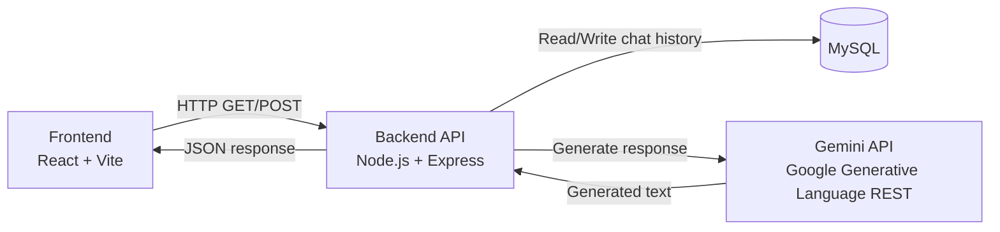
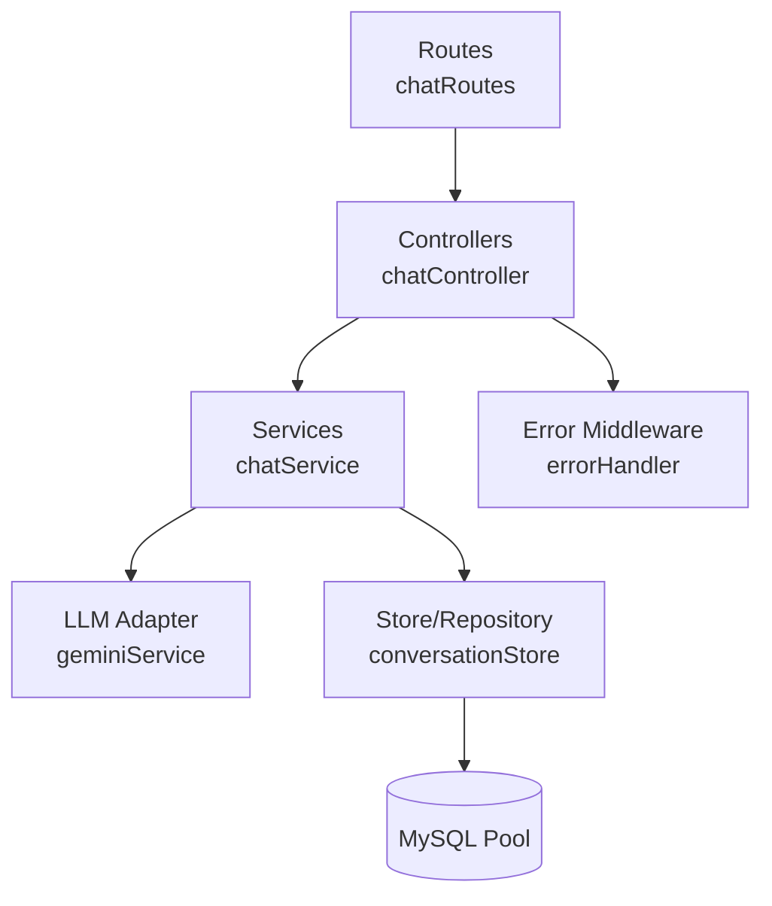
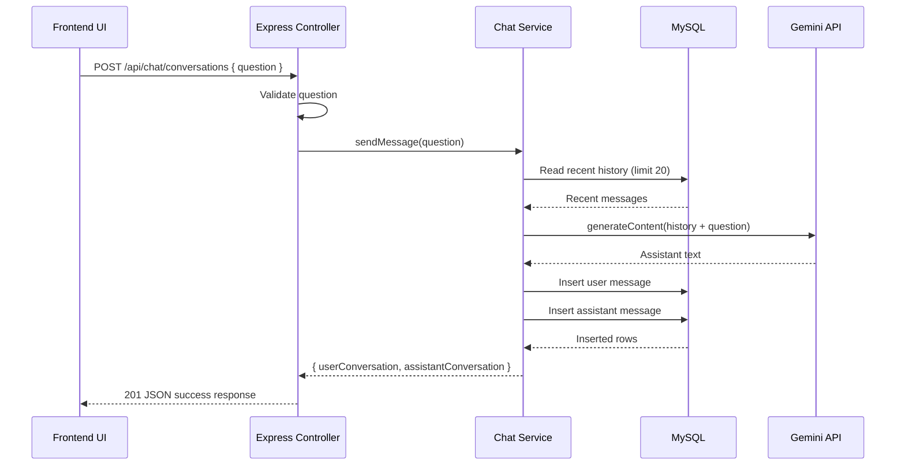

# ChatBot Architecture and Design Document

## 1. Purpose and Scope
This document describes the implemented architecture for the ChatBot project, including:
- Frontend behavior and responsibilities
- Backend API, service, and persistence layers
- Integration with Gemini via REST
- Database schema and data flow
- Request/response contracts and error behavior

The design reflects the currently running system in this repository.

## 2. High-Level Architecture



## 3. Runtime Components

### Frontend (React + Vite)
- Maintains local UI state for conversations, loading, retry, and detected user name.
- Calls backend endpoints for history and new messages.
- Uses optimistic UI update for user prompt before server confirmation.
- Persists detected user name in localStorage and displays initials/full name in header.

Main implementation files:
- frontend/src/App.jsx
- frontend/src/components/MessageList/MessageList.jsx
- frontend/src/components/ChatMessage/ChatMessage.jsx
- frontend/src/components/ChatHeader/ChatHeader.jsx

### Backend (Express API)
- Exposes health and chat endpoints.
- Validates request payloads.
- Coordinates history retrieval, Gemini call, and message persistence.
- Applies centralized error middleware for consistent JSON error responses.

Main implementation files:
- backend/src/app.js
- backend/src/routes/chatRoutes.js
- backend/src/controllers/chatController.js
- backend/src/services/chatService.js
- backend/src/services/geminiService.js
- backend/src/middleware/errorHandler.js

### Database (MySQL)
- Stores each message as one row in conversations.
- Persists role, content, and timestamp.
- Supports full history fetch and bounded recent-history queries for prompt context.

Main implementation files:
- backend/src/config/database.js
- backend/src/store/conversationStore.js
- backend/sql/schema.sql

### External LLM
- Gemini is called through Axios using the Google Generative Language REST API.
- Backend transforms local message roles into Gemini-compatible roles.

Main implementation file:
- backend/src/services/geminiService.js

## 4. Layered Backend Design



Interaction responsibilities:
- Routes: URL-to-controller mapping only.
- Controllers: input validation and HTTP response shaping.
- Services: business orchestration.
- Store: SQL access and row mapping.
- Middleware: consistent error output.

## 5. Request Sequence (POST /api/chat/conversations)



## 6. API Contract

Base URL (local):
- http://localhost:3777

### GET /health
- Purpose: readiness/health check.
- Response:

```json
{
  "success": true,
  "message": "Server is healthy"
}
```

### GET /api/chat/conversations
- Purpose: fetch full stored chat history in ascending order.
- Response shape:

```json
{
  "success": true,
  "data": {
    "conversations": [
      {
        "id": 1,
        "role": "user",
        "content": "Hello",
        "createdAt": "2026-05-28T16:12:22.000Z"
      }
    ]
  }
}
```

### POST /api/chat/conversations
- Purpose: submit user prompt and receive persisted user + assistant records.
- Request body:

```json
{
  "question": "Say hello in one sentence."
}
```

- Success response (201):

```json
{
  "success": true,
  "data": {
    "userConversation": {
      "id": 1,
      "role": "user",
      "content": "Say hello in one sentence.",
      "createdAt": "2026-05-28T16:12:22.000Z"
    },
    "assistantConversation": {
      "id": 2,
      "role": "assistant",
      "content": "Hello there!",
      "createdAt": "2026-05-28T16:12:22.000Z"
    }
  }
}
```

- Validation error example (400):

```json
{
  "success": false,
  "message": "question is required and must be a non-empty string."
}
```

## 7. Data Model

Database:
- chatbot_db

Table: conversations
- id: BIGINT UNSIGNED, primary key, auto increment
- role: ENUM('user', 'assistant')
- content: TEXT
- created_at: TIMESTAMP default current timestamp

Operational behavior:
- Full history is returned ordered by id ASC.
- Recent context for LLM uses latest N records (currently 20), then reordered chronologically before sending to Gemini.

## 8. Configuration

Backend configuration is loaded from .env via backend/src/config/env.js.

Key settings:
- PORT
- API_PREFIX
- MYSQL_HOST
- MYSQL_PORT
- MYSQL_USER
- MYSQL_PASSWORD
- MYSQL_DATABASE
- GEMINI_API_KEY
- GEMINI_MODEL
- GEMINI_API_BASE_URL

Frontend configuration:
- VITE_API_BASE_URL (defaults to http://localhost:3777/api)

## 9. Error Handling Strategy
- Controllers forward errors to centralized middleware.
- errorHandler preserves explicit status when provided (for example, HttpError 400).
- Unknown errors default to status 500.
- If response headers were already sent, middleware delegates to Express default handler.

## 10. Startup and Lifecycle
- server startup flow:
  - Load env
  - Ensure schema/table exists
  - Start Express listener
- shutdown flow:
  - Capture SIGINT/SIGTERM
  - Close MySQL pool
  - Exit process

## 11. Design Decisions and Tradeoffs
- Single conversations table keeps implementation simple and transparent.
- No user/account partitioning yet, so all messages share one global history.
- Context window is fixed (20 messages) to limit token/cost growth.
- CORS is currently open for local development convenience.

## 12. Current Constraints and Next Design Steps
Current constraints:
- No authentication/authorization
- No per-user or per-thread chat sessions
- No streaming token responses
- No observability metrics/tracing

Recommended next steps:
- Add user and thread identifiers to schema
- Add auth middleware and scoped history queries
- Add pagination for GET history
- Add request logging and structured telemetry
- Add integration tests for route and service behavior
